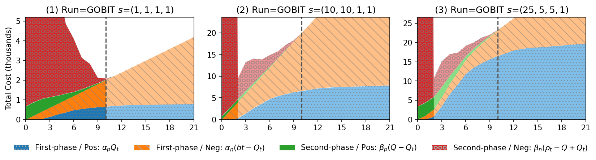
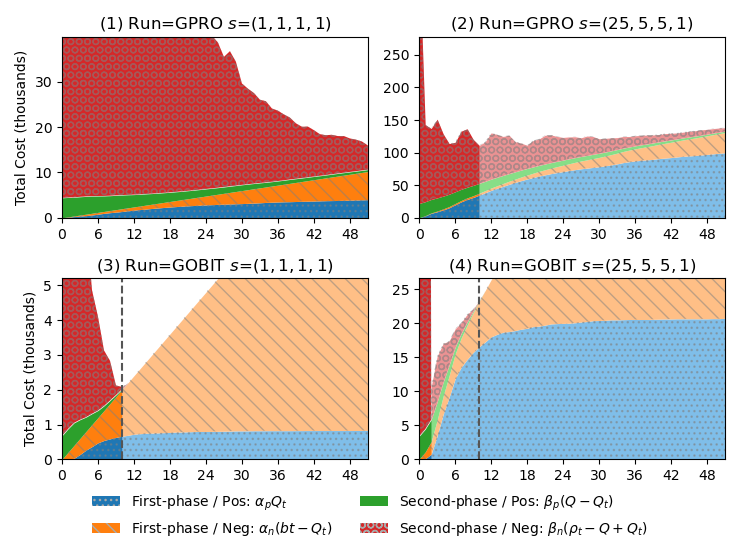

# TARexp: A Python Framework for Technology-Assisted Review Experiments

`TARexp` is an opensource Python framework for conducting TAR experiments with various
reference implementation to algorithms and methods that are commonly-used.

The experiments are fully reproducible and easy to conduct ablation studies. 
For studying components that do not change the selection process of the review documents, 
`TARexp` supports replying TAR runs and experimenting these components offline. 

Helper functions to support results analysis are also avaiable. 

Please visit our Google Colab Demo to check out the full running example [](https://colab.research.google.com/github/eugene-yang/tarexp/blob/main/examples/exp-demo.ipynb)

Please refer to the documentation for more detail: https://eugene.zone/tarexp. 

## Get Started

You can install `TARexp` from PyPi by running
```bash
pip install tarexp
```

Or install it with the lastest version from GitHub
```bash
pip install git+https://github.com/eugene-yang/tarexp.git
```

If you like to build it from source, please use
```bash
git clone https://github.com/eugene-yang/tarexp.git
cd tarexp
python setup.py bdist_wheel
pip install dist/*.whl
```

In Python, please use the following command to import both the main package and the components
```python
import tarexp
from tarexp import component
```

## Running Workflow

The following snippet is an example of creating a `dataset` instance for `TARexp`. 
For `scikit-learn` rankers, the structure of the dataset is bascially a sparse `scipy` matrix
for the vectorized dataset and a list or an array of binary labels with the same length of the matrix. 

```python
from sklearn import datasets
import pandas as pd
rcv1 = datasets.fetch_rcv1()
X = rcv1['data']
rel_info = pd.DataFrame(rcv1['target'].todense().astype(bool), columns=rcv1['target_names'])
ds = tarexp.SparseVectorDataset.from_sparse(X)
```

The following snippet defines a set of componets to use for a workflow, 
```python
setting = component.combine(component.SklearnRanker(LogisticRegression, solver='liblinear'), 
                            component.PerfectLabeler(), 
                            component.RelevanceSampler(), 
                            component.FixedRoundStoppingRule(max_round=20))()
```

And to declare a workflow, simply put in your dataset, setting, and other parameters to the workflow. 
```python
workflow = tarexp.OnePhaseTARWorkflow(
    ds.set_label(rel_info['GPRO']), 
    setting, 
    seed_doc=[1023], 
    batch_size=200, 
    random_seed=123
)
```

And finally, you can start executing the workflow by running it as an iterator. 
We also support everything from [`ir-measures`](https://ir-measur.es/en/latest/) as evaluation metrics.

```python
recording_metrics = [ir_measures.RPrec, tarexp.OptimisticCost(target_recall=0.8, cost_structure=(25,5,5,1))]
for ledger in workflow:
    print("Round {}: found {} positives in total".format(ledger.n_rounds, ledger.n_pos_annotated)) 
    print("metric:", workflow.getMetrics(recording_metrics))
```

Besides standard IR evaluation metrics, we also implement `OptimisticCost` as cost-based evaluation metrics in `TARexp`. Please refer to [this paper](https://arxiv.org/abs/2106.09866) for more information and consider citing it if you use this measurement. 

## Running Experiments

### TAR Experiments

`tarexp.TARExperiment` is a wrapper and dispatcher for running TAR experiments with different settings. 
It construct all combinations of the input settings and dispath each TAR run to execute.

The following command defines a set of 6 TAR runs which consists of 3 topics and each has 2 runs with batch size 200 and 100.  

```python
exp = tarexp.TARExperiment('./my_tar_exp/', random_seed=123, max_round_exec=20,
                            metrics=[RPrec, P@10, tarexp.OptimisticCost(target_recall=0.8, cost_structure=(1,10,1,10))],
                            tasks=tarexp.TaskFeeder(ds, rel_info[['GPRO', 'GOBIT', 'E141']]),
                            components=setting,
                            workflow=tarexp.OnePhaseTARWorkflow, batch_size=[200, 100])
```

To start running the experiment, please use the following command which will execute with single processor and resume from any crash runs if exist in the output directory. 
```python
results = exp.run(n_processes=1, resume=True, dump_frequency=10)
```

### Testing Stopping Rules

`TARexp` also encourages experiments on stopping rules. 
We have built-in a number of stopping rules in the package and continuing to update them. 

The following snippet is an exmaple for running a replay experiment based on a set of existing 
TAR runs with a list of stopping rules defined in `stopping_rules` arguments. 

```python
replay_exp = tarexp.StoppingExperimentOnReplay(
                    './test_stopping_rules', random_seed=123,
                    tasks=tarexp.TaskFeeder(ds, rel_info[['GPRO','GOBIT', 'E141']]),
                    replay=tarexp.OnePhaseTARWorkflowReplay,
                    saved_exp_path='./my_tar_exp',
                    metrics=[tarexp.OptimisticCost(target_recall=0.8, cost_structure=(1,1,1,1)),
                             tarexp.OptimisticCost(target_recall=0.9, cost_structure=(1,1,1,1))],
                    stopping_rules=[
                        component.KneeStoppingRule(), 
                        component.BudgetStoppingRule(), 
                        component.BatchPrecStoppingRule(), 
                        component.ReviewHalfStoppingRule(),
                        component.Rule2399StoppingRule(), 
                        component.QuantStoppingRule(0.4, 0), 
                        component.QuantStoppingRule(0.2, 0),
                        component.QuantStoppingRule(0.8, 0),
                        component.CHMHeuristicsStoppingRule(0.8),
                        component.CHMHeuristicsStoppingRule(0.4),
                        component.CHMHeuristicsStoppingRule(0.2),
                    ]
            )

stopping_results = replay_exp.run(resume=True, dump_frequency=10)
```

### Visualization

`TARexp` also provide visualization tools for TAR runs. 

`createDFfromResults` creates a pandas DataFrame from either the result variable
```python
df = tarexp.helper.createDFfromResults(results, remove_redundant_level=True)
```
Or the output directory
```python
df = tarexp.helper.createDFfromResults('./my_tar_exp', remove_redundant_level=True)
```

And the following command provides you the cost dynamic graph introduced in [this paper](https://arxiv.org/abs/2106.09866). 
```python
tarexp.helper.cost_dynamic(
    df.loc[:, 'GOBIT', :].groupby(level='dataset'),
    recall_targets=[0.8], cost_structures=[(1,1,1,1), (10, 10, 1, 1), (25, 5, 5, 1)],
    with_hatches=True
)
```



Alternatively, you can also create this graph by using a command line interface
```bash
python -m tarexp.helper.plotting \
       --runs GPRO=./my_tar_exp/GPRO.61b1f31a0a29de634939db77c0dde383/  \
              GOBIT=./my_tar_exp/GOBIT.ae86e0b37809cb139dfa1f4cf914fb9b/  \
       --cost_structures 1-1-1-1 25-5-5-1 --y_thousands --with_hatches
```



## Feedback

Any feedback is welcome! 
You can reach out to us either by emailing the author or rasing an issue! 

## Reference

The demo paper of `TARexp` is currently under review. 

If you use the cost measure or the cost dynamic graphs, pleas consider citing this paper
```bibtex
@inproceedings{cost-structure,
	author = {Eugene Yang and David D. Lewis and Ophir Frieder},
	title = {On Minimizing Cost in Legal Document Review Workflows},
	booktitle = {Proceedings of the ACM Symposium on Document Engineering (DocEng)},
	year = {2021},
	url = {https://arxiv.org/abs/2106.09866}
}
```


